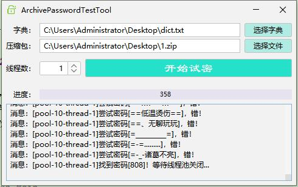

# ArchivePasswordTestTool
Java Swing 加密压缩包穷举密码工具

# 图


# 参考或借用
[BigFileReader](https://github.com/yongzhidai/ToolClass/blob/master/src/main/java/cn/dyz/tools/file/BigFileReader.java)

### 更新记录

<details>

<summary>点击展开</summary>

#### 2022.4.28

提交了初版代码，基本能用，但BUG不少。

使用字典方式对带密码的7z、zip文件进行跑密，多线程

此工具仅适用于你自己的忘了密码的压缩包

入口方法：
```
icu.whereis.ap.Main
```
</details>
